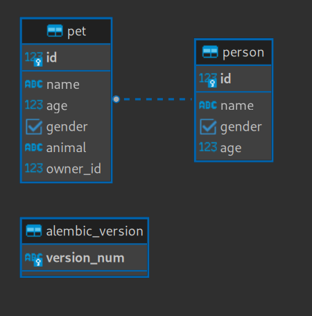

Тестовый API без аутентификации
===

API после развертывания принимает запросы на `3001`. **Swagger** доступен
по `localhost:3001/docs`.

# Запуск
В корне приложения лежит файл `docker-compose.yml` для быстрого деплоя. Чтобы им воспользоваться,
нужно выполнить команду:
```commandline
docker compose up -d
```
Поднимется БД, соберется образ сервера, применятся миграции alembic.

Чтобы остановить приложение:
```commandline
docker compose down
```

# База данных
API использует свою БД PostgreSQL для хранения данных. Информация для подключения по умолчанию:
- порт: `5430`
- название: `example_database`
- имя пользователя: `postgres`
- пароль пользователя: `postgres`

# Схема БД
После применения всех миграций alembic, схема БД будет выглядеть так:



Модели объектов описаны декларативным способом и расположены в `api_no_auth.entities`.